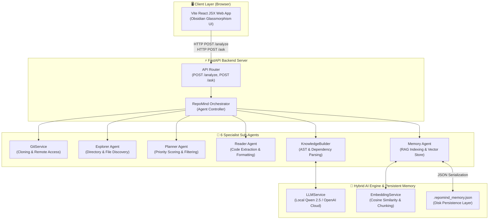
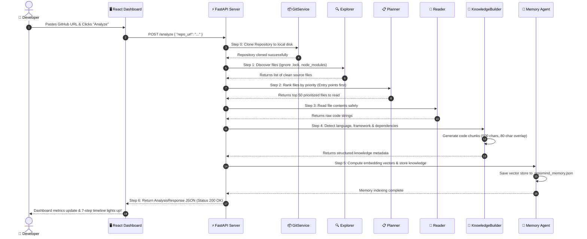
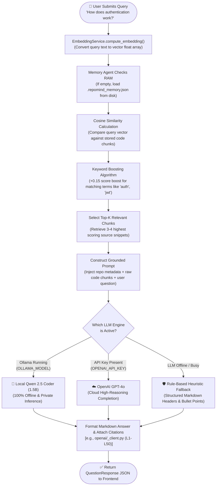
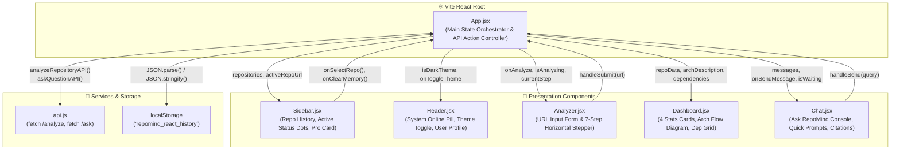

# 📊 RepoMind Architecture & Workflow Diagrams

This document compiles standalone, professional **Mermaid.js** diagrams illustrating the system architecture, automated analysis lifecycle, RAG vector pipeline, and frontend state machine of **RepoMind**.

---

## 1. High-Level System Architecture
This diagram illustrates the decoupling between the client browser, the FastAPI server, the 6 specialist AI sub-agents, and the persistent vector memory layer.

---

## 2. The 7-Step Repository Analysis Lifecycle
This sequence diagram details the exact order of execution from the moment a user submits a GitHub URL to when the repository is fully indexed in memory.

---

## 3. Hybrid RAG Vector Pipeline (`/ask`)
This flowchart maps how natural language queries are embedded, boosted, retrieved from disk memory, and synthesized into citation-backed answers.

---

## 4. Frontend Component Hierarchy & State Flow
This diagram breaks down the Vite React JSX web application architecture, illustrating how state flows down from `App.jsx` to individual components and how API actions trigger visual updates.

